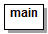
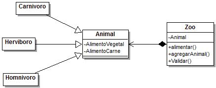
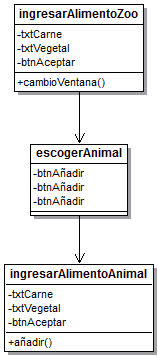
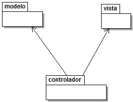

# Programa Principios de programacion
# Responsabilidad unica
establece que cada módulo o clase debe tener responsabilidad sobre
una sola parte de la funcionalidad proporcionada por el software y
esta responsabilidad debe estar encapsulada en su totalidad por la clase.
# Abierto/Cerrado
establece que «una entidad de software debe quedarse abierta para su extensión,
pero cerrada para su modificación». Es decir, se debe poder extender el 
comportamiento de tal entidad pero sin modificar su código fuente.
# Sustitucion de liskov
Cada clase que hereda de otra puede usarse como su padre sin necesidad de 
conocer las diferencias entre ellas.

